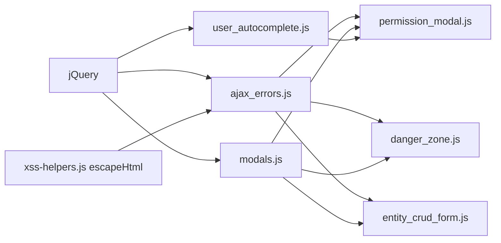

# Shared Frontend Form Modules

Agent-focused reference for the reusable JavaScript helpers under
`frontend_private/static/private/js/forms/`. These modules eliminate the
~90-line inline blocks that used to be duplicated across dozens of
Django templates handling CRUD forms, permission modals, and danger-zone
delete flows.

## Why this exists

Before this refactor every `pages/<entity>/{new,details,danger_zone,user_permissions}.html`
template carried its own copy of the same ~90-line jQuery block: build
FormData, JSON.stringify, fire `$.ajax`, show/hide modals, parse errors.
Any fix had to land in every copy. The v2 unwrap migration made this
worse because each copy also hard-coded a reference to the legacy
`{data: ..., success: true}` envelope.

Consolidating into shared modules:

- One place to fix bugs and tune UX (keyboard handling, debounce, etc.)
- One set of tests per module instead of N near-duplicate suites
- Stops new pages from copy-pasting the latest stale version
- Removed ~2400 lines across ~20 templates so far (remaining templates
  tracked in `tasks/todos/api-v2-coverage-backfill.md`)

## Directory

```
frontend_private/static/private/js/forms/
├── ajax_errors.js               showAjaxErrorModal(xhr)
├── ajax_errors.test.js
├── modals.js                    FormModals.{showSuccess, showError, ...}
├── modals.test.js
├── danger_zone.js               attachDangerZone({...})
├── danger_zone.test.js
├── entity_crud_form.js          attachEntityCrudForm({...})
├── entity_crud_form.test.js
├── permission_modal.js          attachPermissionModal({...})
├── permission_modal.test.js
├── team_permission_modal.js     attachTeamPermissionModal({...})
├── mutex_lock.js                attachMutexLock({...})
├── fleet_watchlist.js           attachFleetWatchlist({...})
├── fleet_settings_form.js       attachFleetSettingsForm({...})
├── fleet_entity_crud.js         attachFleetEntityCrud({...})
├── gis_view_form.js             attachGisViewForm({...})
├── tagged_entity_list.js        attachTaggedEntityList({...})
├── tool_file_upload.js          attachToolFileUpload({...})
└── survey_table_tool.js         attachSurveyTableTool({...})

frontend_private/templates/snippets/
├── cylinder_modal_helpers.js    cylinder{Reset,Populate,Collect}* helpers
└── sensor_modal_helpers.js      sensor{Reset,Populate,Collect}* helpers

frontend_public/static/js/
└── auth_form.js                 attachAuthForm({...}), validateEmail(email)
```

Every module is a plain `<script src>`-loadable file (no ES module
import) so Django templates can pull it via ``. The public
symbols are named functions / namespaces attached to `window` implicitly
via declaration.

Dependencies:



## Module-by-module reference

### `ajax_errors.js` - `showAjaxErrorModal(xhr)`

Replaces the inline ``
snippet. Walks `xhr.responseJSON` for `error`, `errors`, or `detail`
keys (DRF conventions) and falls back to a generic
`[Status N] Server Error` message with a support email link. Always
finishes by flex-displaying `#modal_error`.

```js
$.ajax({
    url: '/api/v2/projects/.../',
    method: 'DELETE',
    error: function (xhr) { showAjaxErrorModal(xhr); },
});
```

### `modals.js` - `FormModals`

Namespace with thin wrappers over the three stock modal partials.

```js
FormModals.bindAutoDismiss();  // body-click hides any visible modal
FormModals.showSuccess('It worked.');
FormModals.showError('Server exploded.');
FormModals.showConfirmation();
FormModals.hideConfirmation();
FormModals.hideAll();
```

Assumes the page includes `snippets/modal_success.html`,
`snippets/modal_error.html`, and (optionally)
`snippets/modal_confirmation_delete.html`.

### `danger_zone.js` - `attachDangerZone(options)`

One call wires the full "Delete with confirmation" flow:

- `#btn_delete` -> shows `#modal_confirmation`
- `#btn_confirmed_delete` -> DELETE `options.deleteUrl`
- On 2xx: show success, schedule redirect
- On error: show the DRF error via `showAjaxErrorModal`

```js
attachDangerZone({
    deleteUrl: "",
    successMessage: 'The project has been deleted successfully.',
    successRedirect: "",
    redirectDelayMs: 2000,  // optional
});
```

Used by (all 7 danger-zone templates): project, experiment, team,
gis_view, cylinder_fleet, sensor_fleet, surface_network.

### `entity_crud_form.js` - `attachEntityCrudForm(options)`

Generic "new/edit" JSON form handler.

```js
attachEntityCrudForm({
    formId: 'new_team_form',
    endpoint: "",
    method: 'POST',                         // or PUT / PATCH
    successMessage: 'The team has been created.',
    successRedirect: "",
    // optional:
    submitBtnId: 'btn_submit',
    beforeSubmit: function (payload) {       // return false to cancel
        if (!payload.name) { FormModals.showError('Name is required.'); return false; }
        return true;
    },
    redirectFromResponse: (resp) => Urls['private:team_details'](resp.id),
    reloadOnSuccess: true,                   // equivalent to successRedirect: window.location
    serialize: (payload) => JSON.stringify(payload),  // custom body
    redirectDelayMs: 2000,
});
```

Reads `<form id={formId}>` via `new FormData(form)`, converts to an
object with `Object.fromEntries`, and `JSON.stringify`'s it for the
request body. The CSRF token hidden input is picked up automatically.

Used by: project/new, project/details, team/new, team/details,
surface_network/new, surface_network/details, cylinder_fleet/new,
sensor_fleet/new, user/password, user/preferences.

### `permission_modal.js` - `attachPermissionModal(options)`

Wires the full Add / Edit / Delete modal used on every permission
management page.

```js
attachPermissionModal({
    endpoint: "",
    autocompleteUrl: "",
    addModalTitle: "Add a collaborator to the project",
    addModalHeader: "Who would you like to add?",
    editModalTitle: "How shall we modify this user's access?",
    fieldName: 'level',         // or 'role' for team memberships
    fieldLabel: 'Access Level', // used in validation error message
    reloadDelayMs: 2000,
});
```

Expects the page to render a permission modal with:

- `#permission_modal` (`flex` -> visible)
- `#permission_modal_title` / `#permission_modal_header`
- `#permission_form` with `#user`, `#user_suggestions`, `#level`
- `#btn_submit_add`
- Buttons: `#btn_open_add_user`, `.btn_open_edit_perm` (with `data-user`,
  `data-{fieldName}`), `.btn_delete_perm` (with `data-user`), `.btn_close`

Validation:

- `#user` must look like an email address (RFC-lite regex)
- `#{fieldName}` must be non-empty

Loads the shared `attachUserAutocomplete` helper for the Add form.

Used by: project/user_permissions, experiment/user_permissions,
cylinder_fleet/user_permissions, sensor_fleet/user_permissions,
surface_network/user_permissions.

For `team/memberships.html` (which renames the DOM nodes to
`#membership_modal`, `.btn_open_edit_membership`, etc. and uses `role`
instead of `level`) pass a `selectors` override:

```js
attachPermissionModal({
    endpoint: "",
    autocompleteUrl: "",
    fieldName: 'role',
    fieldLabel: 'Membership Role',
    selectors: {
        modal: '#membership_modal',
        modalTitle: '#membership_modal_title',
        modalHeader: '#membership_modal_header',
        form: '#membership_form',
        openEditBtn: '.btn_open_edit_membership',
        deleteBtn: '.btn_delete_membership',
    },
});
```

### `team_permission_modal.js` - `attachTeamPermissionModal(options)`

Sibling of `permission_modal.js` where the primary entity is a team
picked from a static `<select>` (not an autocomplete input). Used by
`project/team_permissions.html`.

```js
attachTeamPermissionModal({
    endpoint: "",
    addModalTitle: "Add a Team to the project",
    addModalHeader: "What team would you like to add?",
    editModalTitle: "How shall we modify this team's access?",
    fieldLabel: 'Access Level',
});
```

Edit-mode appends the currently-assigned team as an `<option>` (from
the button's `data-team` / `data-team-name`) so the user sees what
they're modifying, then locks the `<select>` via
`addClass('readonly')` + `mousedown`/`keydown` blockers.

### `mutex_lock.js` - `attachMutexLock(options)`

Wires the project lock / unlock buttons on `project/mutex_history.html`:

```js
attachMutexLock({
    unlockUrl: "",
    lockUrl:   "",  // optional
});
```

- `.btn_unlock` -> POST `unlockUrl`, reload on success.
- `#btn_lock_project` -> POST `lockUrl`, reload on success.

Either URL can be omitted when the template doesn't render the
corresponding button.

### `auth_form.js` - `attachAuthForm(options)`

Lives under `frontend_public/static/js/auth_form.js` (outside the
`forms/` folder because the public templates load differently). Used by
the allauth headless pages: `login`, `signup`, `password_reset`,
`password_reset_from_key`.

Renders errors in the inline `#error_div` (not the modal), walks
`xhr.responseJSON` for `error` / `errors[0].message`.

```js
attachAuthForm({
    formId: 'login_form',
    endpoint: "",
    onSuccess: function () {
        window.location.href = "";
    },
    validators: [
        (payload) => validateEmail(payload.email) ? null : 'Invalid email',
    ],
    errorHandler: function (xhr) {
        // Return a string to override the default error extraction,
        // or null to fall through.
    },
    // Useful for signup/reset-from-key: treat allauth's 401 on the
    // "verify email" redirect as a success.
    treat401AsSuccess: true,
    // Mutator that runs before validators. Return false to cancel the
    // submission (used by signup for the anti-robot `cave_marker` gate).
    beforeAjax: function (payload, formData) { ... },
});
```

### `fleet_watchlist.js` - `attachFleetWatchlist(options)`

Wires the cylinder + sensor fleet watchlist pages: DataTables init with
sensible defaults (no paging/search/info), days-filter form validation,
and the Excel export button. The action-modal (for editing a cylinder
from a watchlist row) is a separate concern handled by
`fleet_entity_crud.js`.

```js
attachFleetWatchlist({
    tableSelector: '#watchlist_cylinders_table',
    dataTableOptions: { columnDefs: [{ targets: -1, orderable: false }] },
    formSelector: '#watchlist_form',     // optional (for pages without days filter)
    exportBtnSelector: '#btn_export_excel',
    exportUrlBuilder: function (days) {
        return Urls['api:v2:cylinder-fleet-watchlist-export'](fleetId) + '?days=' + days;
    },
});
```

### `fleet_settings_form.js` - `attachFleetSettingsForm(options)`

Wires the "Fleet Name + Description" save flow shared by cylinder and
sensor fleet detail pages.

```js
attachFleetSettingsForm({
    endpoint: Urls['api:v2:cylinder-fleet-detail'](fleetId),
    successMessage: 'The cylinder fleet has been updated.',
});
```

### `fleet_entity_crud.js` - `attachFleetEntityCrud(options)`

Shared Add / Edit / Delete modal flow for entities that live under a
fleet (cylinders under a cylinder fleet, sensors under a sensor fleet).
Also used by the cylinder watchlist page for edit-only flows.

Domain-specific field wiring (which modal inputs map to which JSON
fields) is injected via callbacks: `resetForCreate()`,
`populateForEdit($button)`, and `collectPayload(isEdit)`. The cylinder
and sensor modal helpers live in template snippets
(`snippets/cylinder_modal_helpers.js`, `snippets/sensor_modal_helpers.js`)
and are shared between watchlist and details pages.

```js
attachFleetEntityCrud({
    entityLabel: 'cylinder',
    modalSelector: '#cylinder_modal',
    deleteModalSelector: '#delete_cylinder_modal',
    editButtonSelector: '.edit-cylinder-btn',
    deleteButtonSelector: '.delete-cylinder-btn',
    deleteIdInputSelector: '#delete_cylinder_id',
    addButtonSelector: '#add_cylinder_btn, #add_first_cylinder_btn',
    saveButtonSelector: '#cylinder_modal_save',
    cancelSelectors: '#cylinder_modal_cancel, #cylinder_modal_close_x',
    deleteCancelSelectors: '#delete_modal_cancel, #delete_modal_close_x',
    confirmDeleteSelector: '#delete_modal_confirm',
    modalTitleSelector: '#cylinder_modal_title',
    addTitle: 'Add Cylinder',
    editTitle: 'Edit Cylinder',
    listEndpoint: "",
    detailEndpoint: function (id) { return Urls['api:v2:cylinder-detail'](id); },
    resetForCreate: cylinderResetForCreate,
    populateForEdit: cylinderPopulateForEdit,
    collectPayload: cylinderCollectPayload,
});
```

### `gis_view_form.js` - `attachGisViewForm(options)`

Drives the dynamic project-picker grid on `gis_view/new.html` and
`gis_view/details.html`. Handles project list loading, lazy
commit-SHA loading per row, add/remove project rows, and the cross-row
"Specific Commit must have a commit selected" validation.

```js
// CREATE
attachGisViewForm({
    endpoint: "",
    method: 'POST',
    projectsEndpoint: "",
    commitsEndpointBuilder: function (pid) {
        return Urls['api:v2:project-geojson-commits'](pid);
    },
    successMessage: 'The GIS view has been created successfully.',
    onSuccess: function (data) {
        window.location.href = Urls['private:gis_view_details'](data.id);
    },
});

// EDIT - set `seedFromExistingRows: true` + a `newRowIdPrefix` so the
// dynamic ids of newly-added rows don't collide with server-rendered ones.
attachGisViewForm({
    endpoint: "",
    method: 'PUT',
    projectsEndpoint: "",
    commitsEndpointBuilder: ...,
    successMessage: 'The GIS view has been updated successfully.',
    seedFromExistingRows: true,
    initialProjectCounter: {{ gis_view.project_views.count }},
    newRowIdPrefix: 'new_',
});
```

### `tagged_entity_list.js` - `attachTaggedEntityList(options)`

Generic CRUD scaffold for "named + colored + owned" list pages where
rows are loaded via GET, rendered into both a desktop table and a
mobile cards grid, and support per-row edit + delete with confirmation.

The caller supplies three domain callbacks (render, openEditModalForEntity,
collectEditPayload) and a handful of selectors; everything else is
shared. Returns `{reload(), openEditModal(id), openDeleteModal(id)}`
for external triggers (e.g. GPX import refreshes `gps_tracks`).

Used by `station_tags.html` (PUT) and `gps_tracks.html` (PATCH).

```js
const listApi = attachTaggedEntityList({
    listEndpoint: "",
    detailEndpointBuilder: function (id) { return Urls['api:v2:station-tag-detail'](id); },
    editMethod: 'PUT',
    renderList: renderTags,
    entityLabel: 'tag',
    loadFailedMessage: 'Error loading tags',
    editFormSelector: '#edit-tag-form',
    editIdInputSelector: '#edit-tag-id',
    editModalSelector: '#edit-tag-modal',
    editModalTitleSelector: '#edit-modal-title',
    createBtnSelector: '#btn-create-tag',
    closeEditModalSelectors: '.btn-close-edit-modal',
    deleteModalSelector: '#delete-tag-modal',
    deleteIdInputSelector: '#delete-tag-id',
    confirmDeleteSelector: '#btn-confirm-delete',
    closeDeleteModalSelectors: '.btn-close-delete-modal',
    resetEditModal: function () { ... },
    openEditModalForEntity: function (tag) { ... },
    openDeleteModalForEntity: function (tag) { ... },
    collectEditPayload: function () { ... },
});
```

### `tool_file_upload.js` - `attachToolFileUpload(options)`

Drop-zone + file-validation helper for the DMP tool pages
(`tools/dmp2json.html` and `tools/dmp_doctor.html`). Handles
drag/drop, click-to-browse, extension validation, and the shared
`#fileNameDisplay` / `#fileErrorDisplay` UI. The AJAX call-site
(convert to JSON vs download) stays in each template.

```js
const dropzone = attachToolFileUpload({
    dropZoneSelector: '#fileDropZone',
    fileInputSelector: '#fileInput',
    fileNameSelector: '#fileNameDisplay',
    fileErrorSelector: '#fileErrorDisplay',
    statusSelector: '#status',
    actionButtonSelector: '#downloadBtn',
    allowedExtensions: ['dmp'],
    readyMessage: 'File ready for conversion',
    invalidMessage: 'Invalid file type. Please upload a .dmp file',
});

// Later:
const file = dropzone.getFile();
dropzone.reset();
dropzone.setStatus('Loading...', 'red', 'bold');
```

### `survey_table_tool.js` - `attachSurveyTableTool(options)`

Scaffold for the editable contenteditable `<table>` used by
`tools/xls2dmp.html` (7 columns) and `tools/xls2compass.html`
(10 columns incl. station + flags + comment). Handles:

- Enter-to-move-below keyboard navigation
- Paste parsing (via caller-supplied `parseClipboardText` because the
  two tools handle header rows differently)
- Per-cell validation (via caller-supplied `validateCell`)
- "The last row must be empty except for <these columns>" rule
- Toolbar wiring for `#pasteExcelBtn`, `#addRowBtn`, `#clearBtn`

```js
const surveyTable = attachSurveyTableTool({
    tableBodySelector: '#dataTable tbody',
    statusSelector:    '#status',
    addRowBtnSelector: '#addRowBtn',
    clearBtnSelector:  '#clearBtn',
    pasteBtnSelector:  '#pasteExcelBtn',
    COLUMNS: ['depth','length','azimuth','left','right','up','down'],
    lastRowAllowedColumns: ['depth'],
    lastRowErrorMessage: function (remove) {
        return 'Error: The last row should only have Station Depth. Remove: '
               + remove.join(', ') + '.';
    },
    validateCell: function (value, column, isLastRow) { ... },
    parseClipboardText: function (text) { ... },
});

// Later:
if (!surveyTable.validateTable()) { return; }
const rows = surveyTable.collectRowObjects();  // [{col: value, ...}, ...]
```

## Load order in templates

Because these files don't use ES modules, load order matters:

```html

<script src=""></script>
<script src=""></script>
<script src=""></script>
<script>
    $(window).on('load', function () {
        attachDangerZone({ ... });
    });
</script>

```

`ajax_errors.js` requires the global `escapeHtml` from `xss-helpers.js`
(loaded in `base_private.html`). `permission_modal.js` additionally
requires `user_autocomplete.js`.

## Testing conventions

Each shared module has a co-located `*.test.js` run by Vitest. The tests
load the real jQuery (from `frontend_public/static/js/vendors/jquery-3.7.1.js`),
the real `xss-helpers.js`, and the real module source via
`readFileSync` + `eval`, so production code is exercised verbatim. This
mirrors the pattern in `frontend_private/static/private/js/tests/dashboard.test.js`.

Common mocks:

- `globalThis.jQuery.ajax = vi.fn((opts) => { ...; return {}; })` - invoke
  `opts.beforeSend({ setRequestHeader: () => true })` then `opts.success()`
  or `opts.error(xhr)` to exercise the appropriate branch.
- `Object.defineProperty(window, 'location', {...})` to capture redirects
  without actually navigating.
- `vi.useFakeTimers()` + `vi.advanceTimersByTime(...)` to skip the
  success-redirect delay.

## Remaining work

All 12 originally-planned shared modules have landed. Going forward,
when the same ~80-line jQuery pattern appears in more than one template,
extract it following the conventions above.

The remaining templates that still inline ``
(and therefore haven't been migrated to `showAjaxErrorModal`) are:

- `pages/projects.html`
- `pages/project/upload.html`
- `pages/user/dashboard.html`
- `pages/experiment/new.html`
- `pages/experiment/details.html`

These are each a single non-duplicated inline block; they're functionally
correct and not blocking anything. Replace the include with
`<script src="forms/ajax_errors.js"></script>` + `showAjaxErrorModal(xhr)`
if you happen to be modifying them for another reason.

Follow-up candidates for per-template JS test coverage are tracked in
`tasks/todos/api-v2-coverage-backfill.md`.
