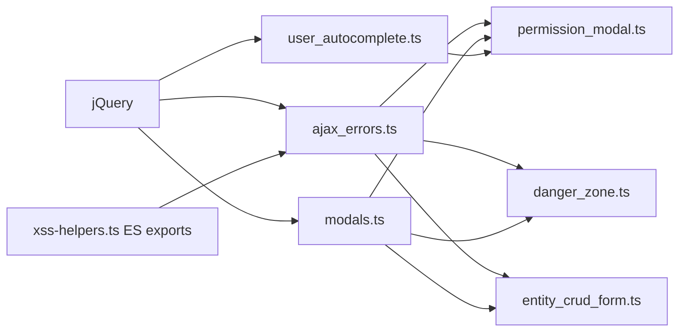

# Shared Frontend Form Modules

Agent-focused reference for the reusable TypeScript helpers under
`frontend_private/static/private/ts/forms/`. These modules eliminate the
~90-line inline blocks that used to be duplicated across dozens of Django
templates handling CRUD forms, permission modals, and danger-zone delete flows.

## Why this exists

Before this refactor every
`pages/<entity>/{new,details,danger_zone,user_permissions}.html` template
carried its own copy of the same ~90-line jQuery block: build FormData,
JSON.stringify, fire `$.ajax`, show/hide modals, parse errors. Any fix had to
land in every copy. The v2 unwrap migration made this worse because each copy
also hard-coded a reference to the legacy `{data: ..., success: true}` envelope.

Consolidating into shared modules:

- One place to fix bugs and tune UX (keyboard handling, debounce, etc.)
- One set of tests per module instead of N near-duplicate suites
- Stops new pages from copy-pasting the latest stale version
- Keep reusable form behavior in modules while Vite route controllers own page
  wiring.

## Directory

```
frontend_private/static/private/ts/forms/
├── ajax_errors.ts               showAjaxErrorModal(xhr)
├── ajax_errors.test.ts
├── modals.ts                    FormModals.{showSuccess, showError, ...}
├── modals.test.ts
├── danger_zone.ts               attachDangerZone({...})
├── danger_zone.test.ts
├── entity_crud_form.ts          attachEntityCrudForm({...})
├── entity_crud_form.test.ts
├── permission_modal.ts          attachPermissionModal({...})
├── permission_modal.test.ts
├── team_permission_modal.ts     attachTeamPermissionModal({...})
├── mutex_lock.ts                attachMutexLock({...})
├── fleet_watchlist.ts           attachFleetWatchlist({...})
├── fleet_settings_form.ts       attachFleetSettingsForm({...})
├── fleet_entity_crud.ts         attachFleetEntityCrud({...})
├── fleet_modal_helpers.ts       shared cylinder/sensor field helpers
├── gis_view_form.ts             attachGisViewForm({...})
├── tagged_entity_list.ts        attachTaggedEntityList({...})
├── tool_file_upload.ts          attachToolFileUpload({...})
└── survey_table_tool.ts         attachSurveyTableTool({...})

frontend_public/static/ts/
└── auth_form.ts                 attachAuthForm({...}), validateEmail(email)
```

These are ES modules imported by route controllers under
`frontend_common/controllers/`. Controllers export `init(context)`, consume
inert JSON from Django, and import each helper explicitly. Vite owns the
dependency graph and template loading; functions are not published on `window`.
jQuery and Django's generated `Urls` remain established external globals.

The examples below describe JavaScript options inside controllers. Server URLs
and scalar values arrive through `context`; callbacks remain in JavaScript and
must not be serialized into template JSON. See
[Vite integration](vite-assets.md).

Dependencies:


```mermaid
flowchart LR
    jquery[jQuery] --> ac[user_autocomplete.ts]
    jquery --> errors[ajax_errors.ts]
    jquery --> modals[modals.ts]
    xss[xss-helpers.ts ES exports] --> errors
    errors --> danger[danger_zone.ts]
    modals --> danger
    errors --> crud[entity_crud_form.ts]
    modals --> crud
    errors --> perm[permission_modal.ts]
    modals --> perm
    ac --> perm
```

## Module-by-module reference

### `ajax_errors.ts` - `showAjaxErrorModal(xhr)`

Shared AJAX error rendering walks `xhr.responseJSON` for `error`, `errors`, or
`detail` keys (DRF conventions) and falls back to a generic
`[Status N] Server Error` message with a support email link. Always finishes by
flex-displaying `#modal_error`.

```js
$.ajax({
  url: "/api/v2/projects/.../",
  method: "DELETE",
  error: function (xhr) {
    showAjaxErrorModal(xhr);
  },
});
```

### `modals.ts` - `FormModals`

Namespace with thin wrappers over the three stock modal partials.

```js
FormModals.bindAutoDismiss(); // body-click hides any visible modal
FormModals.showSuccess("It worked.");
FormModals.showError("Server exploded.");
FormModals.showConfirmation();
FormModals.hideConfirmation();
FormModals.hideAll();
```

Assumes the page includes `snippets/modal_success.html`,
`snippets/modal_error.html`, and (optionally)
`snippets/modal_confirmation_delete.html`.

### `danger_zone.ts` - `attachDangerZone(options)`

One call wires the full "Delete with confirmation" flow:

- `#btn_delete` -> shows `#modal_confirmation`
- `#btn_confirmed_delete` -> DELETE `options.deleteUrl`
- On 2xx: show success, schedule redirect
- On error: show the DRF error via `showAjaxErrorModal`

```js
attachDangerZone({
  deleteUrl: context.deleteUrl,
  successMessage: "The project has been deleted successfully.",
  successRedirect: context.successRedirect,
  redirectDelayMs: 2000, // optional
});
```

Used by the shared entity Danger Zone for GIS Layer, GPS Track, Surface Network,
Experiment, Cylinder Fleet, Sensor Fleet, Landmark Collection, GIS View, and
Team. Project retains its purpose-built template.

### `entity_crud_form.ts` - `attachEntityCrudForm(options)`

Generic "new/edit" JSON form handler.

```js
attachEntityCrudForm({
  formId: "new_team_form",
  endpoint: context.endpoint,
  method: "POST", // or PUT / PATCH
  successMessage: "The team has been created.",
  successRedirect: context.successRedirect,
  // optional:
  submitBtnId: "btn_submit",
  beforeSubmit: function (payload) {
    // return false to cancel
    if (!payload.name) {
      FormModals.showError("Name is required.");
      return false;
    }
    return true;
  },
  redirectFromResponse: (resp) => Urls["private:team_details"](resp.id),
  reloadOnSuccess: true, // equivalent to successRedirect: window.location
  serialize: (payload) => JSON.stringify(payload), // custom body
  redirectDelayMs: 2000,
});
```

Reads `<form id={formId}>` via `new FormData(form)`, converts to an object with
`Object.fromEntries`, and `JSON.stringify`'s it for the request body. The CSRF
token hidden input is picked up automatically.

Used by: project/new, project/details, team/new, team/details,
surface_network/new, surface_network/details, cylinder_fleet/new,
sensor_fleet/new, user/password, user/preferences.

### `permission_modal.ts` - `attachPermissionModal(options)`

Wires the full Add / Edit / Delete modal used on every permission management
page.

```js
attachPermissionModal({
  endpoint: context.endpoint,
  autocompleteUrl: context.autocompleteUrl,
  addModalTitle: "Add a collaborator to the project",
  addModalHeader: "Who would you like to add?",
  editModalTitle: "How shall we modify this user's access?",
  fieldName: "level", // or 'role' for team memberships
  fieldLabel: "Access Level", // used in validation error message
  reloadDelayMs: 2000,
});
```

Expects the page to render a permission modal with:

- `#permission_modal` (`flex` -> visible)
- `#permission_modal_title` / `#permission_modal_header`
- `#permission_form` with `#user`, `#user_suggestions`, `#level`
- `#btn_submit_add`
- Buttons: `#btn_open_add_user`, `.btn_open_edit_perm` (with `data-user`,
  `data-{fieldName}`), `.btn_delete_perm` (with `data-user`), `.btn_close`

Validation:

- `#user` must look like an email address (RFC-lite regex)
- `#{fieldName}` must be non-empty

Loads the shared `attachUserAutocomplete` helper for the Add form.

Used by Project and by the shared entity User Access template for GIS Layer, GPS
Track, Surface Network, Experiment, Cylinder Fleet, Sensor Fleet, and Landmark
Collection.

For `team/memberships.html` (which renames the DOM nodes to `#membership_modal`,
`.btn_open_edit_membership`, etc. and uses `role` instead of `level`) pass a
`selectors` override:

```js
attachPermissionModal({
  endpoint: context.endpoint,
  autocompleteUrl: context.autocompleteUrl,
  fieldName: "role",
  fieldLabel: "Membership Role",
  selectors: {
    modal: "#membership_modal",
    modalTitle: "#membership_modal_title",
    modalHeader: "#membership_modal_header",
    form: "#membership_form",
    openEditBtn: ".btn_open_edit_membership",
    deleteBtn: ".btn_delete_membership",
  },
});
```

### `team_permission_modal.ts` - `attachTeamPermissionModal(options)`

Sibling of `permission_modal.ts` where the primary entity is a team picked from
a static `<select>` (not an autocomplete input). Used by
`project/team_permissions.html`.

```js
attachTeamPermissionModal({
  endpoint: context.endpoint,
  addModalTitle: "Add a Team to the project",
  addModalHeader: "What team would you like to add?",
  editModalTitle: "How shall we modify this team's access?",
  fieldLabel: "Access Level",
});
```

Edit-mode appends the currently-assigned team as an `<option>` (from the
button's `data-team` / `data-team-name`) so the user sees what they're
modifying, then locks the `<select>` via `addClass('readonly')` +
`mousedown`/`keydown` blockers.

### `mutex_lock.ts` - `attachMutexLock(options)`

Wires the project lock / unlock buttons on `project/mutex_history.html`:

```js
attachMutexLock({
  unlockUrl: context.unlockUrl,
  lockUrl: context.lockUrl, // optional
});
```

- `.btn_unlock` -> POST `unlockUrl`, reload on success.
- `#btn_lock_project` -> POST `lockUrl`, reload on success.

Either URL can be omitted when the template doesn't render the corresponding
button.

### `auth_form.ts` - `attachAuthForm(options)`

Lives under `frontend_public/static/ts/auth_form.ts` (outside the `forms/`
folder because it owns the public authentication flow). Used by the allauth
headless pages: `login`, `signup`, `password_reset`, `password_reset_from_key`.

Renders errors in the inline `#error_div` (not the modal), walks
`xhr.responseJSON` for `error` / `errors[0].message`.

```js
attachAuthForm({
    formId: 'login_form',
    endpoint: context.endpoint,
    onSuccess: function () {
        window.location.href = context.successRedirect;
    },
    validators: [
        (payload) => validateEmail(payload.email) ? null : 'Invalid email',
    ],
    errorHandler: function (xhr) {
        // Return a string to override the default error extraction,
        // or null to fall through.
    },
    // Useful for signup/reset-from-key: treat allauth's 401 on the
    // "verify email" redirect as a success.
    treat401AsSuccess: true,
    // Mutator that runs before validators. Return false to cancel the
    // submission (used by signup for the anti-robot `cave_marker` gate).
    beforeAjax: function (payload, formData) { ... },
});
```

### `fleet_watchlist.ts` - `attachFleetWatchlist(options)`

Wires the cylinder + sensor fleet watchlist pages: DataTables init with sensible
defaults (no paging/search/info), days-filter form validation, and the Excel
export button. The action-modal (for editing a cylinder from a watchlist row) is
a separate concern handled by `fleet_entity_crud.ts`.

```js
attachFleetWatchlist({
  tableSelector: "#watchlist_cylinders_table",
  dataTableOptions: { columnDefs: [{ targets: -1, orderable: false }] },
  formSelector: "#watchlist_form", // optional (for pages without days filter)
  exportBtnSelector: "#btn_export_excel",
  exportUrlBuilder: function (days) {
    return (
      Urls["api:v2:cylinder-fleet-watchlist-export"](fleetId) + "?days=" + days
    );
  },
});
```

### `fleet_settings_form.ts` - `attachFleetSettingsForm(options)`

Wires the "Fleet Name + Description" save flow shared by cylinder and sensor
fleet detail pages.

```js
attachFleetSettingsForm({
  endpoint: Urls["api:v2:cylinder-fleet-detail"](fleetId),
  successMessage: "The cylinder fleet has been updated.",
});
```

### `fleet_entity_crud.ts` - `attachFleetEntityCrud(options)`

Shared Add / Edit / Delete modal flow for entities that live under a fleet
(cylinders under a cylinder fleet, sensors under a sensor fleet). Also used by
the cylinder watchlist page for edit-only flows.

Domain-specific field wiring (which modal inputs map to which JSON fields) is
injected via callbacks: `resetForCreate()`, `populateForEdit($button)`, and
`collectPayload(isEdit)`. The cylinder and sensor field helpers live in
`forms/fleet_modal_helpers.ts` and are imported by the fleet controller for
watchlist and details pages.

```js
attachFleetEntityCrud({
  entityLabel: "cylinder",
  modalSelector: "#cylinder_modal",
  deleteModalSelector: "#delete_cylinder_modal",
  editButtonSelector: ".edit-cylinder-btn",
  deleteButtonSelector: ".delete-cylinder-btn",
  deleteIdInputSelector: "#delete_cylinder_id",
  addButtonSelector: "#add_cylinder_btn, #add_first_cylinder_btn",
  saveButtonSelector: "#cylinder_modal_save",
  cancelSelectors: "#cylinder_modal_cancel, #cylinder_modal_close_x",
  deleteCancelSelectors: "#delete_modal_cancel, #delete_modal_close_x",
  confirmDeleteSelector: "#delete_modal_confirm",
  modalTitleSelector: "#cylinder_modal_title",
  addTitle: "Add Cylinder",
  editTitle: "Edit Cylinder",
  listEndpoint: context.listEndpoint,
  detailEndpoint: function (id) {
    return Urls["api:v2:cylinder-detail"](id);
  },
  resetForCreate: cylinderResetForCreate,
  populateForEdit: cylinderPopulateForEdit,
  collectPayload: cylinderCollectPayload,
});
```

### `gis_view_form.ts` - `attachGisViewForm(options)`

Drives the dynamic project-picker grid on `gis_view/new.html` and
`gis_view/details.html`. Handles project list loading, lazy commit-SHA loading
per row, add/remove project rows, and the cross-row "Specific Commit must have a
commit selected" validation.

```js
// CREATE
attachGisViewForm({
    endpoint: context.endpoint,
    method: 'POST',
    projectsEndpoint: context.projectsEndpoint,
    commitsEndpointBuilder: function (pid) {
        return Urls['api:v2:project-geojson-commits'](pid);
    },
    successMessage: 'The GIS view has been created successfully.',
    onSuccess: function (data) {
        window.location.href = Urls['private:gis_view_details'](data.id);
    },
});

// EDIT - set `seedFromExistingRows: true` + a `newRowIdPrefix` so the
// dynamic ids of newly-added rows don't collide with server-rendered ones.
attachGisViewForm({
    endpoint: context.endpoint,
    method: 'PUT',
    projectsEndpoint: context.projectsEndpoint,
    commitsEndpointBuilder: ...,
    successMessage: 'The GIS view has been updated successfully.',
    seedFromExistingRows: true,
    initialProjectCounter: context.initialProjectCounter,
    newRowIdPrefix: 'new_',
});
```

### `tagged_entity_list.ts` - `attachTaggedEntityList(options)`

Generic loader and optional CRUD scaffold for named and colored list pages. Rows
are loaded via GET and rendered into both a desktop table and a mobile cards
grid. Callers may configure per-row edit/delete modals or use list-only mode and
link each row to a standard settings workflow.

Every caller supplies `renderList`. Mutation callers also supply the relevant
domain callbacks and selectors; list-only callers omit all modal configuration.
Returns `{reload(), openEditModal(id), openDeleteModal(id)}` for external
triggers (e.g. GPX import refreshes `gps_tracks`).

Used by `station_tags.html` for CRUD and by `gps_tracks.html` and
`gis_layers.html` in list-only mode. GPS Tracks and GIS Layers render download
plus the standard Open action and move metadata/access/deletion into their
shared settings pages.

```js
const listApi = attachTaggedEntityList({
    listEndpoint: context.listEndpoint,
    detailEndpointBuilder: function (id) { return Urls['api:v2:station-tag-detail'](id); },
    editMethod: 'PUT',
    renderList: renderTags,
    entityLabel: 'tag',
    loadFailedMessage: 'Error loading tags',
    editFormSelector: '#edit-tag-form',
    editIdInputSelector: '#edit-tag-id',
    editModalSelector: '#edit-tag-modal',
    editModalTitleSelector: '#edit-modal-title',
    createBtnSelector: '#btn-create-tag',
    closeEditModalSelectors: '.btn-close-edit-modal',
    deleteModalSelector: '#delete-tag-modal',
    deleteIdInputSelector: '#delete-tag-id',
    confirmDeleteSelector: '#btn-confirm-delete',
    closeDeleteModalSelectors: '.btn-close-delete-modal',
    resetEditModal: function () { ... },
    openEditModalForEntity: function (tag) { ... },
    openDeleteModalForEntity: function (tag) { ... },
    collectEditPayload: function () { ... },
});
```

## Shared entity settings templates

Compatible settings pages live under
`frontend_private/templates/pages/shared/entity_settings/`. They centralize the
same responsive navigation, Details form, User Access cards/table and modal, and
Danger Zone used across entity types. A view supplies domain data and URLs; it
must not copy the shared markup into a model-specific template.

The shared templates accept these context contracts:

- `entity_settings_base_template` selects an existing model shell when one is
  required; otherwise the shared base is used.
- Details receives `entity`, `entity_label`, `entity_label_lower`,
  `details_form_id`, `details_method`, `api_detail_url`, `listing_url`, and
  `details_success_message`. `show_description`, `show_color`, and the optional
  download values control only the fields/actions supported by that model.
- User Access receives `permissions`, `permission_levels`,
  `permission_endpoint`, modal text, and access flags. Permission querysets are
  ordered by descending level and then user email to keep every model aligned.
- Danger Zone receives `entity_label`, `api_detail_url`, `listing_url`, and
  `danger_success_message`. Its warning copy is owned by the template rather
  than supplied by individual views.

The responsive User Access layout is deliberately self-contained in the
template: `md:hidden` selects mobile cards and `hidden md:block` selects the
desktop table. Do not move those essential visibility rules to a route-specific
stylesheet. Otherwise a missing or stale asset registration can render both UI
variants simultaneously on mobile.

Current consumers are GIS Layer and GPS Track for all three pages; Surface
Network for Details, User Access, and Danger Zone; Experiment, Cylinder Fleet,
Sensor Fleet, and Landmark Collection for User Access and Danger Zone; and GIS
View and Team for Danger Zone. Project remains separate where its existing
workflow has intentional domain-specific markup.

### `tool_file_upload.ts` - `attachToolFileUpload(options)`

Drop-zone + file-validation helper for the DMP tool pages (`tools/dmp2json.html`
and `tools/dmp_doctor.html`). Handles drag/drop, click-to-browse, extension
validation, and the shared `#fileNameDisplay` / `#fileErrorDisplay` UI. The AJAX
call-site (convert to JSON vs download) stays in each route controller.

```js
const dropzone = attachToolFileUpload({
  dropZoneSelector: "#fileDropZone",
  fileInputSelector: "#fileInput",
  fileNameSelector: "#fileNameDisplay",
  fileErrorSelector: "#fileErrorDisplay",
  statusSelector: "#status",
  actionButtonSelector: "#downloadBtn",
  allowedExtensions: ["dmp"],
  readyMessage: "File ready for conversion",
  invalidMessage: "Invalid file type. Please upload a .dmp file",
});

// Later:
const file = dropzone.getFile();
dropzone.reset();
dropzone.setStatus("Loading...", "red", "bold");
```

### `survey_table_tool.ts` - `attachSurveyTableTool(options)`

Scaffold for the editable contenteditable `<table>` used by `tools/xls2dmp.html`
(7 columns) and `tools/xls2compass.html` (10 columns incl. station + flags +
comment). Handles:

- Enter-to-move-below keyboard navigation
- Paste parsing (via caller-supplied `parseClipboardText` because the two tools
  handle header rows differently)
- Per-cell validation (via caller-supplied `validateCell`)
- "The last row must be empty except for <these columns>" rule
- Toolbar wiring for `#pasteExcelBtn`, `#addRowBtn`, `#clearBtn`

```js
const surveyTable = attachSurveyTableTool({
    tableBodySelector: '#dataTable tbody',
    statusSelector:    '#status',
    addRowBtnSelector: '#addRowBtn',
    clearBtnSelector:  '#clearBtn',
    pasteBtnSelector:  '#pasteExcelBtn',
    COLUMNS: ['depth','length','azimuth','left','right','up','down'],
    lastRowAllowedColumns: ['depth'],
    lastRowErrorMessage: function (remove) {
        return 'Error: The last row should only have Station Depth. Remove: '
               + remove.join(', ') + '.';
    },
    validateCell: function (value, column, isLastRow) { ... },
    parseClipboardText: function (text) { ... },
});

// Later:
if (!surveyTable.validateTable()) { return; }
const rows = surveyTable.collectRowObjects();  // [{col: value, ...}, ...]
```

## Route integration

Templates load logical assets with `vite_styles`, `vite_preload`, and
`vite_script`, and declare controller context using inert JSON. The
`danger-zone` controller, for example, imports `attachDangerZone` and passes its
context after `afterWindowLoad()`. The `permission-modal` controller similarly
imports `attachPermissionModal`. Shared dependencies such as `FormModals`,
`showAjaxErrorModal`, and `escapeHtml` are imported by the consuming modules;
templates must not manually order first-party script tags or run inline setup.

Register/build new controller entries before referencing them on live routes;
Django's process-cached registry and the served manifest must agree. Established
vendor loading order remains outside Vite.

## Testing conventions

Colocated `*.test.ts` suites run with Vitest and import the real application ES
modules. Existing jQuery-based unit suites load the vendored jQuery source into
their DOM environment; they do not evaluate application modules as classic
scripts. Unit transport spies below exercise helper control flow only. Real
Django/API/storage integration tests establish rendered routes, permissions,
transport, and transaction behavior; see
[testing boundaries](map-viewer/testing-and-quality.md). Run tests inside the
already-running application container.

Common mocks:

- `globalThis.jQuery.ajax = vi.fn((opts) => { ...; return {}; })` - invoke
  `opts.beforeSend({ setRequestHeader: () => true })` then `opts.success()` or
  `opts.error(xhr)` to exercise the appropriate branch.
- `Object.defineProperty(window, 'location', {...})` to capture redirects
  without actually navigating.
- `vi.useFakeTimers()` + `vi.advanceTimersByTime(...)` to skip the
  success-redirect delay.

## Extension boundaries

A feature used as a precedent defines the existing interaction contract. Reuse
its templates/controllers and change domain labels, fields, and URLs; do not
change its state, caching, breakpoints, or navigation merely to introduce a new
entity. Extract shared behavior only when both consumers have the same concrete
contract. Preserve established product labels unless copy changes are part of
the feature requirement. Parser diagnostics belong in actionable errors and
operator evidence, not a new user-visible lifecycle.

## Typed shared input helpers

The shared non-form-directory helpers `color-picker.ts` and
`user_autocomplete.ts` retain their existing jQuery integration. The color
picker still returns its setter function directly, lowercases complete colors,
and does not synthesize change events. `ColorPickerOptions` names the existing
selector roles; input/data assertions express the established DOM contract.

Autocomplete records live in `ts-types/domain/autocomplete.ts`. Responses enter
as unknown and pass through the existing array check, preserving rejection of
the legacy response envelope. The existing three-character threshold, 250-ms
debounce, request aborts, three-row display, keyboard state and lack of teardown
remain unchanged. Typed tests keep the real approved jQuery runtime and replace
only the transport capabilities the helper consumes. These annotations add no
network requests, listeners, or browser work.

## Strict form contracts

The form helpers keep their existing jQuery callbacks and mutable facades. Their
option and payload types live under `ts-types/domain/forms/`, so transport and
presentation policies remain owned by the helper that implements them. Untrusted
AJAX values enter as `unknown`; erased assertions describe existing backend and
DOM contracts without adding fallback behavior. The narrow jQuery augmentation
records its supported boolean `beforeSend` return, and the DataTables
declaration covers the watchlist options actually used.

Direct helper suites exercise initialization, request serialization, callback
ordering, pending state, cancellation, and modal transitions with the real
vendored jQuery. Type annotations add no validation or per-row processing. GIS
project loading and the survey clipboard handler retain their existing
fire-and-forget promise behavior.

Controller contexts are typed separately under `ts-types/controllers/`.
Authentication keeps per-mode validation order and the original signup marker
mutation; permission controllers forward the original context object. The GIS
view controller copies context while retaining nested identities and resolves
its finite Django routes lazily. Generated URL functions declare `this: void`
because their implementation does not depend on a receiver. Initialization
suites verify load timing, missing inputs, repeated wiring, helper failures, and
ignored helper return values.

The fleet controller uses a finite set of cylinder/sensor detail and export
routes. Its settings, watchlist and entity helpers retain their initialization
order and endpoint-specific options. The tools remain separate controllers: DMP
repair sends adjustment metadata with a file, DMP-to-JSON presents returned
JSON, XLS-to-DMP uses seven columns and its quoted CSV parser, and
XLS-to-Compass uses ten columns and its own simpler parser. In particular,
Compass validates whole numeric strings while DMP retains `parseFloat` input
behavior. They share table/upload mechanics without sharing format policy.

Pure clipboard parsing and cell validation live in separate
`frontend_common/survey/xls2dmp.ts` and `xls2compass.ts` modules. Keeping the
formats separate preserves existing quirks: DMP accepts quoted commas and
numeric prefixes, while Compass splits commas literally and requires complete
numeric values. Neither module parses binary DMP files; conversion and repair
remain backend operations. Pure-policy tests cover header detection, BOMs, empty
cells, unmatched quotes, numeric input and last-row rules, alongside real
controller initialization and request tests.

`frontend_common/presentation/code-result.ts` owns the common result modal's
escaped code block, Prism call, drag-aware overlay dismissal, Escape handler,
clipboard feedback and temporary download URL. Every attachment retains its own
original text and timer. Controllers explicitly supply syntax, MIME type and
filename: JSON uses `application/json` and `survey.json`; Compass uses
`text/plain` and `survey.dat`. Compass alone wraps form-feed characters after
Prism runs, leaving the copied/downloaded text unchanged. Registration remains
at each controller's original initialization point. This extraction adds no
parsing pass, animation work or imports to the public shell.

Tool contexts live under `ts-types/controllers/`; survey payload and error
shapes live in `ts-types/domain/survey-tools.ts`. The existing Prism global and
`window.surveyData` are declared in `ts-types/browser/survey-tools.d.ts` without
adding a runtime package. Direct controller tests cover request payloads,
clipboard parsing, modal/Prism presentation, object URL revocation, form
validation order and repeated initialization.

Project-list, station-tag, Git-tree and revision-history controllers keep their
existing timing and jQuery transport policies. Git and revision requests remain
synchronous; revision menu clones retain independent Alpine scopes. Moment
comparison is a narrow browser declaration. Controller suites exercise real
initialization, empty and malformed responses, repeated wiring and modal
callbacks. Type assertions preserve existing coercion and failure behavior.

## Lifecycle and permission request ownership

`lifecycle.ts` owns the repeated status reset, raw jQuery CSRF field read, and
scheduled navigation operations. Callers retain their selectors, call order, and
decision to reload immediately or after a delay. These form tokens are not
normalized with the map transport's length policy. Navigation resolves the
current `window.location` when the timer fires.

`permission_request.ts` owns the shared JSON request envelope for user and team
permission modals. It sets the captured CSRF header before invoking the owning
modal's validator with jQuery's original receiver and arguments. Success and
error callbacks pass directly to jQuery, preserving their identities and
receiver. User email/role validation, team selection/locking, duplicate-delete
suppression, error retry, and modal presentation remain with their respective
owners. Other form and map transports retain their separate policies.

The real-jQuery permission tests cover denied/invalid submissions, captured
request fields versus validation-time DOM reads, and deletion retries. A narrow
request-boundary test verifies callback forwarding. Entity, fleet, danger-zone,
and mutex suites verify the shared lifecycle without changing immediate versus
deferred navigation or pending-state behavior.
