# Map Viewer Architecture

## Overview

The SpeleoDB map viewer is a **Mapbox GL JS** based application for visualizing
cave survey data, stations, landmarks, exploration leads, GPS tracks, and safety
cylinders. It has two entry points:

| Entry point | File | Purpose |
|---|---|---|
| **Private** | `frontend_private/static/private/js/map_viewer/main.js` | Full-featured viewer for authenticated users. Supports CRUD on stations, landmarks, exploration leads, cylinder installs, GPS tracks, drag-and-drop, context menus, and permission-gated actions. |
| **Public** | `frontend_public/static/js/gis_view_main.js` | Read-only viewer for publicly shared GIS Views. Displays survey GeoJSON only — no stations, landmarks, context menus, or editing. Accessed via a `gisToken`. |

Both entry points share core modules located in
`frontend_private/static/private/js/map_viewer/`. The public viewer imports them
via relative paths (e.g. `../../../frontend_private/...`).

---

## Module Dependency Graph

```mermaid
flowchart TD
    subgraph Entrypoints
        MAIN["main.js<br/>(private)"]
        GIS["gis_view_main.js<br/>(public)"]
    end

    subgraph Core
        CONFIG["config.js"]
        STATE["state.js"]
        API["api.js"]
        UTILS["utils.js"]
    end

    subgraph map/
        CORE["core.js"]
        LAYERS["layers.js"]
        INTERACTIONS["interactions.js"]
        GEOMETRY["geometry.js"]
        DEPTH["depth.js"]
        COLORS["colors.js"]
    end

    subgraph components/
        MODAL["modal.js"]
        NOTIFICATION["notification.js"]
        CONTEXT_MENU["context_menu.js"]
        DEPTH_LEGEND["depth_legend.js"]
        PROJECT_PANEL["project_panel.js"]
        GPS_PANEL["gps_tracks_panel.js"]
        UPLOAD["upload.js"]
    end

    subgraph stations/
        ST_MANAGER["manager.js"]
        ST_UI["ui.js"]
        ST_DETAILS["details.js"]
        ST_TAGS["tags.js"]
        ST_LOGS["logs.js"]
        ST_RESOURCES["resources.js"]
        ST_SENSORS["sensors.js"]
        ST_EXPERIMENTS["experiments.js"]
        ST_CYLINDERS["cylinders.js"]
    end

    subgraph surface_stations/
        SS_MANAGER["manager.js"]
        SS_UI["ui.js"]
    end

    subgraph landmarks/
        LM_MANAGER["manager.js"]
        LM_UI["ui.js"]
    end

    subgraph exploration_leads/
        EL_MANAGER["manager.js"]
        EL_UI["ui.js"]
    end

    %% Private entrypoint imports
    MAIN --> CONFIG & STATE & API & UTILS
    MAIN --> CORE & LAYERS & INTERACTIONS & GEOMETRY
    MAIN --> CONTEXT_MENU & PROJECT_PANEL & GPS_PANEL & DEPTH_LEGEND
    MAIN --> ST_MANAGER & ST_UI & ST_DETAILS & ST_TAGS & ST_CYLINDERS
    MAIN --> SS_MANAGER & SS_UI
    MAIN --> LM_MANAGER & LM_UI
    MAIN --> EL_MANAGER & EL_UI

    %% Public entrypoint imports (subset)
    GIS --> STATE & CONFIG & UTILS
    GIS --> CORE & LAYERS
    GIS --> PROJECT_PANEL & DEPTH_LEGEND

    %% Internal dependencies
    LAYERS --> CONFIG & STATE & COLORS & DEPTH & GEOMETRY & API
    CORE --> CONFIG & STATE & LAYERS
    INTERACTIONS --> STATE & GEOMETRY & CONFIG & LAYERS
    GEOMETRY --> STATE & LAYERS
    UTILS --> NOTIFICATION
    API --> UTILS
    CONFIG --> API
```



---

## Private vs Public Viewer Comparison

| Feature | Private | Public |
|---|:---:|:---:|
| Survey GeoJSON (lines, points) | Yes | Yes |
| Color modes (By Project / By Depth) | Yes | Yes |
| Project visibility toggle panel | Yes | Yes |
| Depth legend | Yes | Yes |
| Auto-zoom to bounds | Yes | Yes |
| Max zoom limiting | No | Yes (`LIMITED_MAX_ZOOM = 13` when `allowPreciseZoom` is false) |
| Subsurface stations (CRUD) | Yes | No |
| Surface stations (CRUD) | Yes | No |
| Landmarks (CRUD, GPX import) | Yes | No |
| Exploration leads (CRUD) | Yes | No |
| Cylinder installs | Yes | No |
| GPS tracks panel | Yes | No |
| Station tags & colors | Yes | No |
| Station logs, resources, sensors, experiments | Yes | No |
| Context menu (right-click) | Yes | No |
| Drag-and-drop repositioning | Yes | No |
| URL `?goto=LAT,LONG` deep linking | Yes | No |
| Permission-gated actions | Yes | No (all read-only) |

**Shared modules used by public viewer:**
`State`, `Config`, `MapCore`, `Layers`, `Utils`, `ProjectPanel`, `DepthLegend`

---

## Initialization Sequence

### Private Viewer (`main.js`)

```
DOMContentLoaded
│
├─ 1. State.init()                          Reset all mutable runtime state
│
├─ 2. Config.loadProjects()                 Fetch project list + permissions from API
├─ 2. Config.loadNetworks()                 Fetch surface network list from API
├─ 2. Config.loadGPSTracks()                Fetch GPS track metadata from API
│
├─ 3. MapCore.init(token, 'map')            Create Mapbox GL map instance
│     └─ State.map = map                    Store reference in State
│     └─ Hide street-level labels
│     └─ Add navigation/fullscreen/scale controls
│
├─ 4. Interactions.init(map, handlers)      Wire click, hover, drag, context-menu
│
├─ 5. DepthLegend.init(map)                 Subscribe to color-mode/depth events
│
└─ map.on('load')                           Data loading phase
    │
    ├─ Layers.loadMarkerImages()            Load SVG icons (cylinder, biology, etc.)
    ├─ Layers.loadProjectVisibilityPrefs()  Restore from localStorage
    │
    ├─ API.getAllProjectsGeoJSON()           Fetch metadata for ALL projects (single call)
    ├─ Config.filterProjectsByGeoJSON()      Remove projects without GeoJSON data
    │
    ├─ ProjectPanel.init()                  Render project list in sidebar
    ├─ GPSTracksPanel.init()                Render GPS tracks panel (all OFF by default)
    ├─ StationTags.init()                   Load user tags + colors
    │
    ├─ For each project (parallel):
    │   ├─ StationManager.loadStationsForProject()
    │   │   └─ Layers.addSubSurfaceStationLayer()
    │   └─ Layers.addProjectGeoJSON(projectId, url)
    │
    ├─ For each network (parallel):
    │   └─ SurfaceStationManager.loadStationsForNetwork()
    │       └─ Layers.addSurfaceStationLayer()
    │
    ├─ Layers.reorderLayers()               Z-order: lines < stations < landmarks
    │
    ├─ LandmarkManager.loadAllLandmarks()
    │   └─ Layers.addLandmarkLayer()
    │
    ├─ ExplorationLeadManager.loadAllLeads()
    │   └─ Layers.refreshExplorationLeadsLayer()
    │
    ├─ Layers.loadCylinderInstalls()        Fetch + display safety cylinders
    │
    ├─ Fly to ?goto= or fitBounds()         Position camera
    │
    └─ Hide loading overlay                 All data loaded
```

### Public Viewer (`gis_view_main.js`)

```
DOMContentLoaded
│
├─ 1. Validate context (viewMode === 'public', gisToken present)
├─ 2. State.init()
├─ 3. MapCore.init(token, 'map') + set maxZoom
├─ 4. DepthLegend.init(map)
│
└─ map.on('load')
    │
    ├─ fetch /api/v1/gis-ogc/view/{gisToken}/geojson
    ├─ Config.setPublicProjects(projects)    Set read-only project list
    ├─ ProjectPanel.init()
    │
    ├─ For each project (parallel):
    │   └─ Layers.addProjectGeoJSON(projectId, url)
    │
    ├─ Layers.reorderLayers()
    ├─ fitBounds() to all projects
    │
    └─ Hide loading overlay
```

---

## State Management

State is split into two singletons with distinct lifecycles:

### `Config` — Loaded Once, Immutable After Init

Holds project/network metadata and permissions. Loaded from API during
initialization and not mutated during the session (except
`filterProjectsByGeoJSON` which prunes the list once).

| Property | Type | Purpose |
|---|---|---|
| `_projects` | `Array` | Project list with `id`, `name`, `permissions`, `geojson_url` |
| `_networks` | `Array` | Surface network list with `id`, `name`, `permission_level` |
| `_gpsTracks` | `Array` | GPS track metadata with `id`, `name`, `file` URL |

Key methods: `hasProjectAccess(id, action)`, `hasNetworkAccess(id, action)`,
`hasScopedAccess(scopeType, scopeId, action)`, `getStationAccess(station)`.

Permission model uses ranked levels:
- Projects: `UNKNOWN(0)` < `WEB_VIEWER(1)` < `READ_ONLY(2)` < `READ_AND_WRITE(3)` < `ADMIN(4)`
- Networks: numeric levels `0` < `1 (READ)` < `2 (WRITE)` < `3 (DELETE/ADMIN)`

### `State` — Mutable Runtime State

All fields are reset by `State.init()`. Every map is keyed by string IDs.

| Field | Type | Purpose |
|---|---|---|
| `map` | `mapboxgl.Map` | The Mapbox GL map instance |
| `projectLayerStates` | `Map<string, boolean>` | Per-project visibility toggle (persisted to localStorage) |
| `networkLayerStates` | `Map<string, boolean>` | Per-network visibility toggle (persisted to localStorage) |
| `allProjectLayers` | `Map<string, string[]>` | Mapbox layer IDs belonging to each project |
| `allNetworkLayers` | `Map<string, string[]>` | Mapbox layer IDs belonging to each network |
| `allStations` | `Map<string, object>` | All subsurface stations by ID |
| `allSurfaceStations` | `Map<string, object>` | All surface stations by ID |
| `allLandmarks` | `Map<string, object>` | All landmarks by ID |
| `explorationLeads` | `Map<string, object>` | Exploration lead markers by ID |
| `cylinderInstalls` | `Map<string, object>` | Cylinder install data by ID |
| `projectDepthDomains` | `Map<string, {min,max}\|null>` | Per-project depth range (computed from GeoJSON) |
| `activeDepthDomain` | `{min, max}\|null` | Merged depth domain across currently visible projects |
| `projectBounds` | `Map<string, LngLatBounds>` | Geographic bounds per project (for auto-zoom) |
| `networkBounds` | `Map<string, LngLatBounds>` | Geographic bounds per network |
| `landmarksVisible` | `boolean` | Global landmark layer visibility (default `true`) |
| `userTags` | `Array` | User's station tags |
| `tagColors` | `Array` | Predefined tag color palette |
| `currentStationForTagging` | `string\|null` | Station being tagged |
| `currentProjectId` | `string\|null` | Currently selected project for station creation |
| `gpsTrackLayerStates` | `Map<string, boolean>` | Per-track visibility (session-only, default OFF) |
| `gpsTrackCache` | `Map<string, object>` | Downloaded GeoJSON data keyed by track ID |
| `gpsTrackLoadingStates` | `Map<string, boolean>` | Which tracks are currently downloading |
| `allGPSTrackLayers` | `Map<string, string[]>` | Mapbox layer IDs belonging to each GPS track |
| `gpsTrackBounds` | `Map<string, LngLatBounds>` | Geographic bounds per GPS track |

---

## Layer System

### Naming Conventions

All Mapbox sources and layers follow consistent naming:

| Entity | Source ID | Layer IDs |
|---|---|---|
| Project GeoJSON | `project-geojson-{projectId}` | `project-layer-{id}` (lines), `project-labels-{id}`, `project-points-{id}` |
| Subsurface Stations | `stations-source-{projectId}` | `stations-{id}-circles`, `stations-{id}-biology-icons`, `stations-{id}-bone-icons`, `stations-{id}-artifact-icons`, `stations-{id}-geology-icons`, `stations-{id}-labels` |
| Surface Stations | `surface-stations-source-{networkId}` | `surface-stations-{id}`, `surface-stations-{id}-labels` |
| Landmarks | `landmarks-source` | `landmarks-layer`, `landmarks-labels` |
| Exploration Leads | `exploration-leads-source` | `exploration-leads-layer` |
| Cylinder Installs | `cylinder-installs-source` | `cylinder-installs-layer`, `cylinder-installs-labels` |
| GPS Tracks | `gps-track-source-{trackId}` | `gps-track-line-{id}` |

### Z-Ordering Strategy

`Layers.reorderLayers()` enforces this stacking order (bottom to top):

1. Mapbox base tiles (satellite imagery)
2. Project survey lines (`project-layer-*`)
3. Project labels + entry points
4. GPS track lines (`gps-track-line-*`)
5. Subsurface station circles and icons
6. Subsurface station labels
7. Surface station symbols and labels
8. Cylinder install icons and labels
9. Exploration lead icons
10. Landmark symbols and labels (always on top)

### Layer Lifecycle

- **Create**: `Layers.addProjectGeoJSON()`, `addSubSurfaceStationLayer()`, etc.
  Each removes any existing source/layers first via `removeLayersAndSource()`,
  then creates new ones.
- **Update**: Source data is updated in-place via `source.setData(data)` for
  position/property changes without recreating layers.
- **Visibility**: Toggled via `map.setLayoutProperty(layerId, 'visibility', ...)`
  through centralized `applyProjectVisibility()` / `applyProjectScopedMarkerVisibility()`.
- **Refresh**: Full re-fetch + re-render triggered by `speleo:refresh-*` events.

### Zoom-Level Visibility

Each layer type has a `minzoom` threshold defined in `ZOOM_LEVELS`:

| Layer Type | Min Zoom |
|---|---|
| Project survey lines | 8 |
| Project line labels | 14 |
| Project entry points (stars) | 10 |
| GPS track lines | 8 |
| Landmarks | 12 (symbol), 16 (label) |
| Subsurface stations | 12 (symbol), 16 (label) |
| Surface stations | 12 (symbol), 16 (label) |
| Cylinder installs | 12 (symbol), 16 (label) |
| Exploration leads | 12 |

---

## Event System

Custom events prefixed with `speleo:` enable decoupled communication between
modules. All are dispatched on `window` unless noted.

### Refresh Events (listened in `main.js`)

| Event | Payload | Purpose |
|---|---|---|
| `speleo:refresh-stations` | `{ projectId }` | Re-fetch and re-render all stations for a project |
| `speleo:refresh-surface-stations` | `{ networkId }` | Re-fetch and re-render surface stations for a network |
| `speleo:refresh-landmarks` | (none) | Re-fetch and re-render all landmarks |
| `speleo:refresh-gps-tracks` | `{ deactivateAll? }` | Clear cache, reload GPS track list, optionally hide all visible tracks |
| `speleo:refresh-cylinder-installs` | (none) | Re-fetch cylinder installs GeoJSON (dispatched on `document`) |

### State Change Events (dispatched by modules)

| Event | Payload | Purpose |
|---|---|---|
| `speleo:color-mode-changed` | `{ mode: 'project'\|'depth' }` | Dispatched by `MapCore.setupColorModeToggle()` when user toggles color mode |
| `speleo:depth-domain-updated` | `{ domain, available, max }` | Dispatched by `Layers.emitDepthDomainUpdated()` when merged depth domain changes |
| `speleo:depth-data-updated` | `{ domain, available, max }` | Legacy alias of `depth-domain-updated` |
| `speleo:gps-track-loading-changed` | `{ trackId, isLoading }` | Dispatched by `Layers.setGPSTrackLoading()` for UI spinner updates |

### Dispatchers and Listeners

| Event | Dispatched By | Listened By |
|---|---|---|
| `refresh-stations` | `Layers.refreshStationsAfterChange()` | `main.js` |
| `refresh-surface-stations` | `Layers.refreshSurfaceStationsAfterChange()` | `main.js` |
| `refresh-landmarks` | Landmark CRUD modules | `main.js` |
| `refresh-gps-tracks` | Upload/GPX import modules | `main.js` |
| `refresh-cylinder-installs` | `cylinders.js` | `main.js` |
| `color-mode-changed` | `map/core.js` | `depth_legend.js` |
| `depth-domain-updated` | `map/layers.js` | `depth_legend.js` |
| `gps-track-loading-changed` | `map/layers.js` | `gps_tracks_panel.js` |

---

## Build System

### esbuild Bundling

Each entry point is bundled separately into a single output file:

| Entry | Output | Command |
|---|---|---|
| `frontend_private/static/private/js/map_viewer/main.js` | `frontend_private/static/private/js/dist/map_viewer.bundle.js` | `npm run build:esbuild:private` |
| `frontend_public/static/js/gis_view_main.js` | `frontend_public/static/js/dist/gis_view.bundle.js` | `npm run build:esbuild:public` |

**Development mode** (`npm run dev`): Uses `--watch` + `--sourcemap` for hot
rebuild on file changes. Runs concurrently with Tailwind watchers.

**Production mode** (`npm run build`): Uses `--minify` without sourcemaps.

**Pre-commit** (`npm run pre-commit`): Bundles without minification to produce
readable diffs for review.

### Tailwind CSS

Two separate Tailwind configurations for private and public frontends:

| Config | Input | Output |
|---|---|---|
| `tailwind_css/private/tailwind.config.js` | `tailwind_css/private/style.css` | `frontend_private/static/private/css/style.css` |
| `tailwind_css/public/tailwind.config.js` | `tailwind_css/public/style.css` | `frontend_public/static/css/style.css` |

Production builds use `--minify`.

### Key npm Scripts

| Script | Purpose |
|---|---|
| `npm run dev` | Watch mode for all builds (Tailwind + esbuild, private + public) |
| `npm run build` | Full clean + production build |
| `npm run lint:js` | ESLint across all frontend JS (excludes `dist/` and `vendors/`) |
| `npm run test:js` | Jest test runner for frontend tests |

### Integration Points

- **Pre-commit hooks** (`.pre-commit-config.yaml`): Run `npm run pre-commit`
  which cleans, rebuilds Tailwind, and bundles JS.
- **CI** (`.github/workflows/ci.yml`): `npm install` + `test:js` + `lint:js`.
- **Railway deploy** (`railway.toml`): Production build via root npm commands.
- **Django**: Templates reference the bundled output files in `dist/` directories.
