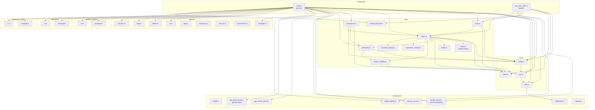

# Map Viewer Architecture

## Overview

The SpeleoDB map viewer is a **MapLibre GL JS** based application for
visualizing cave survey data, stations, landmarks, exploration leads, GPS
tracks, and safety cylinders. It has two entry points:

| Entry point | File                                                    | Purpose                                                                                                                                                                                           |
| ----------- | ------------------------------------------------------- | ------------------------------------------------------------------------------------------------------------------------------------------------------------------------------------------------- |
| **Private** | `frontend_private/static/private/ts/map_viewer/main.ts` | Full-featured viewer for authenticated users. Supports CRUD on stations, landmarks, exploration leads, cylinder installs, GPS tracks, drag-and-drop, context menus, and permission-gated actions. |
| **Public**  | `frontend_public/static/ts/gis_view_main.ts`            | Read-only viewer for publicly shared GIS Views. Displays survey GeoJSON only — no stations, landmarks, context menus, or editing. Accessed via a `gisToken`.                                      |

The root contracts in `ts-types/domain/viewer-composition.ts` compose the narrow
map capabilities consumed by their real modules. They add no runtime adapters or
validation: independent requests still start before map readiness, and
registered async callbacks retain their existing settlement behavior.

Both entry points share core modules located in
`frontend_private/static/private/ts/map_viewer/`. The public viewer imports them
via relative paths (e.g. `../../../frontend_private/...`).

The private toolbar delegates display controls to `MapSettings`, with one
`State.displayPreferences` model and private `DisplayPreferences` persistence.
`Layers` composes marker category/type gates with country/project/network
selections. Managers are launched separately from display settings. The
fullscreen viewer host owns visual overlays and the same toolbar instance.
Public initialization uses default display preferences and its existing
controls. See [Settings architecture and UX](settings.md) for lifecycle,
navigation, accessibility, extension, and performance contracts.

GIS Geometry adds private-only small-shape authoring through
`GISGeometriesPanel` and `GeometryEditor`. It uses the established
API/Config/State/Layers lifecycle and a shared vector renderer. `Interactions`
delegates exclusively to the active editor; draft geometry remains isolated
until an atomic, revision-checked save. The public entrypoint neither
initializes the editor nor requests its data. See
[GIS Geometry](../gis-geometries.md) for the complete contract and limits.

`viewer_lifecycle.ts` owns shared viewport sizing, rendered-survey reset, and
map-load/Window source-change registration. It accepts only the survey State
fields it resets and a fullscreen predicate; it imports defaults, not tools,
managers, transport, or action registration. The private root supplies its
fullscreen policy and clears its additional rendered entities and supplies its
load/source-change callbacks. Registration retains the original callback
identities and order without wrapping promises. Callback lifetime, public
prefetch consumption, private startup overlap, and their different source-change
error handling remain in the roots. This keeps shared display behavior usable
without exposing private mutation tools or changing request timing. The shared
Config/API and Layers facades still include mutation endpoint methods; the
public boundary prohibits private tool imports and editing registration, not all
mutation-related strings in the shared asset graph.

`viewer_lifecycle.test.ts` checks the entire transitive public import graph,
including lazy imports and workers, for private tools and action registration.
Runtime tests cover retained State identities and the roots' distinct desktop,
mobile, and fullscreen sizing. Reset replaces rendered containers without
rescanning features or discarding preferences and cached source data.

---

## Temporary map tools

The private distance ruler and geometry editor share the central interaction
dispatcher. Only one tool owns pointer input; the editor activity lifecycle
releases measurement before acquiring camera handlers. Measurement state and
native overlays remain separate from entity data and saved geometry. See
[Distance ruler](measurement.md) for the module interfaces and lifecycle.

## Module Dependency Graph


```mermaid
flowchart TD
    subgraph Entrypoints
        MAIN["main.ts<br/>(private)"]
        GIS["gis_view_main.ts<br/>(public)"]
    end

    subgraph Core
        CONFIG["config.ts"]
        STATE["state.ts"]
        API["api.ts"]
        UTILS["utils.ts"]
    end

    subgraph map/
        CORE["core.ts"]
        LAYERS["layers.ts"]
        INTERACTIONS["interactions.ts"]
        GEOMETRY["geometry.ts"]
        VISIBILITY["project_visibility.ts"]
        OVERLAYS["layers/lazy_overlay.ts"]
        GIS_POPUP["layers/gis_popup.ts"]
        VIEWER_LIFECYCLE["viewer_lifecycle.ts"]
        DEPTH["depth.ts"]
        COLORS["colors.ts<br/>(model-driven)"]
    end

    subgraph components/
        MODAL["modal.ts"]
        NOTIFICATION["notification.ts"]
        CONTEXT_MENU["context_menu.ts"]
        DEPTH_LEGEND["depth_legend.ts"]
        PROJECT_PANEL["project_panel.ts<br/>(country grouping)"]
        GPS_PANEL["gps_tracks_panel.ts"]
        GIS_PANEL["gis_layers_panel.ts<br/>(private only)"]
        UPLOAD["upload.ts"]
    end

    subgraph stations/
        ST_MANAGER["manager.ts"]
        ST_UI["ui.ts"]
        ST_DETAILS["details.ts"]
        ST_TAGS["tags.ts"]
        ST_LOGS["logs.ts"]
        ST_RESOURCES["resources.ts"]
        ST_SENSORS["sensors.ts"]
        ST_EXPERIMENTS["experiments.ts"]
        ST_CYLINDERS["cylinders.ts"]
    end

    subgraph surface_stations/
        SS_MANAGER["manager.ts"]
        SS_UI["ui.ts"]
    end

    subgraph landmarks/
        LM_MANAGER["manager.ts"]
        LM_UI["ui.ts"]
    end

    subgraph exploration_leads/
        EL_MANAGER["manager.ts"]
        EL_UI["ui.ts"]
    end

    %% Private entrypoint imports
    MAIN --> CONFIG & STATE & API & UTILS
    MAIN --> CORE & LAYERS & INTERACTIONS & GEOMETRY
    MAIN --> CONTEXT_MENU & PROJECT_PANEL & GPS_PANEL & GIS_PANEL & DEPTH_LEGEND
    MAIN --> ST_MANAGER & ST_UI & ST_DETAILS & ST_TAGS & ST_CYLINDERS
    MAIN --> SS_MANAGER & SS_UI
    MAIN --> LM_MANAGER & LM_UI
    MAIN --> EL_MANAGER & EL_UI

    %% Public entrypoint imports (subset)
    GIS --> STATE & CONFIG & UTILS
    GIS --> CORE & LAYERS
    GIS --> PROJECT_PANEL & DEPTH_LEGEND
    MAIN & GIS --> VIEWER_LIFECYCLE

    %% Internal dependencies
    LAYERS --> CONFIG & STATE & COLORS & DEPTH & GEOMETRY & API
    LAYERS --> VISIBILITY & OVERLAYS & GIS_POPUP
    CORE --> CONFIG & STATE & LAYERS
    INTERACTIONS --> STATE & GEOMETRY & CONFIG & LAYERS
    GEOMETRY --> CONFIG & VISIBILITY
    VISIBILITY --> STATE
    UTILS --> NOTIFICATION
    API --> UTILS
    CONFIG --> API
```

---

## Private vs Public Viewer Comparison

| Feature                                       | Private |                             Public                             |
| --------------------------------------------- | :-----: | :------------------------------------------------------------: |
| Survey GeoJSON (lines, points)                |   Yes   |                              Yes                               |
| Color modes (By Survey / By Depth)            |   Yes   |                              Yes                               |
| By Shot (source color with survey fallback)   |   Yes   |                               No                               |
| Project colors (model-stored)                 |   Yes   |                      Yes (color from API)                      |
| Country grouping in project panel             |   Yes   |                         No (flat list)                         |
| Project visibility toggle panel               |   Yes   |                              Yes                               |
| Depth legend                                  |   Yes   |                              Yes                               |
| Auto-zoom to bounds                           |   Yes   |                              Yes                               |
| Max zoom limiting                             |   No    | Yes (`LIMITED_MAX_ZOOM = 13` when `allowPreciseZoom` is false) |
| Subsurface stations (CRUD)                    |   Yes   |                               No                               |
| Surface stations (CRUD)                       |   Yes   |                               No                               |
| Landmarks (CRUD, GPX import)                  |   Yes   |                               No                               |
| Exploration leads (CRUD)                      |   Yes   |                               No                               |
| Cylinder installs                             |   Yes   |                               No                               |
| GPS tracks panel                              |   Yes   |                               No                               |
| Private GIS Layers panel                      |   Yes   |                               No                               |
| Station tags & colors                         |   Yes   |                               No                               |
| Station logs, resources, sensors, experiments |   Yes   |                               No                               |
| Context menu (right-click)                    |   Yes   |                               No                               |
| Drag-and-drop repositioning                   |   Yes   |                               No                               |
| URL `?goto=LAT,LONG` deep linking             |   Yes   |                               No                               |
| Permission-gated actions                      |   Yes   |                       No (all read-only)                       |

**Shared modules used by public viewer:** `State`, `Config`, `MapCore`,
`MapSources`, `Layers`, `Utils`, `ProjectPanel`, `DepthLegend`

---

## Initialization Sequence

Both entrypoints schedule independent work **concurrently**: the map is
initialized without waiting for data, and independent network requests are
issued in parallel rather than serially. This is a pure scheduling concern — the
set of functions called and the final rendered state are unchanged. See
`data-flow.md` → "Startup Load Scheduling (Parallelism)" for the rationale and
invariants.

### Private Viewer (`main.ts`)

```
DOMContentLoaded
│
├─ 1. State.resetLayerState()               Reset all mutable runtime state
│
├─ 2. MapCore.init(token, 'map')            Init map IMMEDIATELY (decoupled from data),
│     └─ State.map = map                    so style/tiles download while APIs run
│     └─ Hide street-level labels
│     └─ Add navigation/fullscreen/scale controls
│     └─ Map Source comes from localStorage or DEFAULTS.MAP.DEFAULT_SOURCE_ID
│
├─ 3. Kick off in parallel (NOT awaited here):
│     ├─ configReady = Promise.all([loadProjects, loadNetworks, loadGPSTracks, loadGISLayers])
│     └─ metadataReady = loadGeoJSONMetadata()   prefetch all-projects GeoJSON metadata
│
├─ 4. Interactions.init(map, handlers)      Wire click, hover, drag, context-menu
│
├─ 5. DepthLegend.init(map)                 Subscribe to color-mode/depth events
│
└─ map.on('load')                           Data loading phase
    │
    ├─ await configReady                    Ensure project/network/track lists are ready
    ├─ Promise.all([                        Markers + metadata concurrently
    │     Layers.loadMarkerImages(),        Load SVG icons (cylinder, biology, etc.)
    │     metadataReady,                    (already in-flight from step 3)
    │   ])
    ├─ Layers.loadProjectVisibilityPrefs()  Restore from localStorage
    ├─ Config.filterProjectsByGeoJSON()     Remove projects without GeoJSON data
    │
    ├─ ProjectPanel.init()                  Render project list in sidebar
    │     └─ _applyInitialCountryVisibility()  Enforce country gates on load
    ├─ GPSTracksPanel.init()                Render GPS tracks panel (all OFF by default)
    ├─ GISLayersPanel.init()                Render isolated GIS panel (all OFF by default)
    ├─ StationTags.init()                   Load user tags + colors
    │
    ├─ Promise.all([                        All independent layer phases concurrently:
    │     loadProjectAndStationLayers(),    ├─ stations + project survey GeoJSON
    │     loadSurfaceStationLayers(),       ├─ surface stations per network
    │     loadLandmarkLayers(),             ├─ landmark collections + landmarks
    │     loadExplorationLeadLayers(),      ├─ exploration leads
    │     loadCylinderInstallLayers(),      ├─ safety cylinders
    │     loadVisibleGPSTrackLayers(),      ├─ visible GPS tracks
    │     loadVisibleGISLayers(),           └─ desired GIS Layers
    │   ])
    ├─ Layers.reorderLayers()               Single authoritative z-order pass
    │
    ├─ Fly to ?goto= or fitBounds()         Position camera
    │
    └─ Hide loading overlay                 All data loaded
```

### Public Viewer (`gis_view_main.ts`)

```
DOMContentLoaded
│
├─ 1. Validate context (viewMode === 'public', gisToken present)
├─ 2. State.resetLayerState()
├─ 3. MapCore.init(token, 'map') + set maxZoom
│     └─ Map Source comes from the shared registry used by private viewer
├─ 4. DepthLegend.init(map)
├─ 5. pendingViewData = fetchPublicViewData()   prefetch GIS-View GeoJSON (concurrent)
│
└─ map.on('load')
    │
    ├─ loadPublicMapData(fetchProjects=true)
    │   └─ await pendingViewData             Consume the prefetch (no 2nd request)
    ├─ Config.setPublicProjects(projects)    Set read-only project list
    ├─ ProjectPanel.init()
    │
    ├─ For each project (parallel):
    │   └─ Layers.addProjectGeoJSON(projectId, url)
    │
    ├─ Layers.reorderLayers()
    ├─ fitBounds() to all projects
    │
    └─ Hide loading overlay
```

---

## State Management

State is split into two singletons with distinct lifecycles:

### `Config` — Mutable Metadata and Permission Cache

Holds project/network and overlay metadata and permissions. Its singleton and
getters stay live throughout a session: public setup replaces projects,
filtering prunes projects, GPS/GIS refreshes replace cached lists, and GIS
Geometry saves merge metadata into existing records with `Object.assign`.
Geometry coordinates belong to State rather than this metadata cache. Revision
checks prevent stale responses from overwriting more recent local saves.

The TypeScript configuration/API/utilities/notification cycle retains this
initialization order and mutable identity. Domain records live under
`ts-types/domain/`; annotations do not add validation or clone successful
responses. Strict checking and direct Config/API/Utils/Notification suites cover
cache and record identity, permission normalization, transport settlement, and
CSRF source precedence. The translation adds no feature scans or network
requests.

| Property     | Type    | Purpose                                                                          |
| ------------ | ------- | -------------------------------------------------------------------------------- |
| `_projects`  | `Array` | Project list with `id`, `name`, `permissions`, `country`, `color`, `geojson_url` |
| `_networks`  | `Array` | Surface network list with `id`, `name`, `permission_level`                       |
| `_gpsTracks` | `Array` | Readable GPS track metadata with `id`, `name`, `color`, and signed `file` URL    |

Key methods: `hasProjectAccess(id, action)`, `hasNetworkAccess(id, action)`,
`hasScopedAccess(scopeType, scopeId, action)`, `getStationAccess(station)`,
`getProjectById(id)`, `getGPSTrackById(id)`.

Permission model uses ranked levels:

- Projects: `UNKNOWN(0)` < `WEB_VIEWER(1)` < `READ_ONLY(2)` <
  `READ_AND_WRITE(3)` < `ADMIN(4)`
- Networks: numeric levels `0` < `1 (READ)` < `2 (WRITE)` < `3 (DELETE/ADMIN)`

### `State` — Mutable Runtime State

All fields are reset by `State.resetLayerState()`. Every map is keyed by string
IDs.

| Field                        | Type                           | Purpose                                                                     |
| ---------------------------- | ------------------------------ | --------------------------------------------------------------------------- |
| `map`                        | `maplibregl.Map`               | The MapLibre GL map instance                                                |
| `projectLayerStates`         | `Map<string, boolean>`         | Per-project visibility toggle (persisted to localStorage)                   |
| `networkLayerStates`         | `Map<string, boolean>`         | Per-network visibility toggle (persisted to localStorage)                   |
| `allProjectLayers`           | `Map<string, string[]>`        | MapLibre layer IDs belonging to each project                                |
| `allNetworkLayers`           | `Map<string, string[]>`        | MapLibre layer IDs belonging to each network                                |
| `allStations`                | `Map<string, object>`          | All subsurface stations by ID                                               |
| `allSurfaceStations`         | `Map<string, object>`          | All surface stations by ID                                                  |
| `allLandmarks`               | `Map<string, object>`          | All landmarks by ID                                                         |
| `explorationLeads`           | `Map<string, object>`          | Exploration lead markers by ID                                              |
| `cylinderInstalls`           | `Map<string, object>`          | Cylinder install data by ID                                                 |
| `projectDepthDomains`        | `Map<string, {min,max}\|null>` | Per-project depth range (computed from GeoJSON)                             |
| `activeDepthDomain`          | `{min, max}\|null`             | Merged depth domain across currently visible projects                       |
| `projectBounds`              | `Map<string, LngLatBounds>`    | Geographic bounds per project (for auto-zoom)                               |
| `networkBounds`              | `Map<string, LngLatBounds>`    | Geographic bounds per network                                               |
| `landmarksVisible`           | `boolean`                      | Global landmark layer visibility (default `true`)                           |
| `userTags`                   | `Array`                        | User's station tags                                                         |
| `tagColors`                  | `Array`                        | Predefined tag color palette                                                |
| `currentStationForTagging`   | `string\|null`                 | Station being tagged                                                        |
| `currentProjectId`           | `string\|null`                 | Currently selected project for station creation                             |
| `gpsTrackLayerStates`        | `Map<string, boolean>`         | Per-track visibility (session-only, default OFF)                            |
| `gpsTrackCache`              | `Map<string, object>`          | Downloaded GeoJSON data keyed by track ID                                   |
| `gpsTrackLoadingStates`      | `Map<string, boolean>`         | Which tracks are currently downloading                                      |
| `allGPSTrackLayers`          | `Map<string, string[]>`        | MapLibre layer IDs belonging to each GPS track                              |
| `gpsTrackBounds`             | `Map<string, LngLatBounds>`    | Geographic bounds per GPS track                                             |
| `effectiveProjectVisibility` | `Map<string, boolean>`         | Actual on-map visibility (respects both country gate and individual toggle) |

---

## Layer System

### Naming Conventions

All MapLibre sources and layers follow consistent naming:

| Entity              | Source ID                             | Layer IDs                                                                                                                                                                 |
| ------------------- | ------------------------------------- | ------------------------------------------------------------------------------------------------------------------------------------------------------------------------- |
| Project GeoJSON     | `project-geojson-{projectId}`         | `project-layer-{id}` (lines), `project-labels-{id}`, `project-points-{id}`                                                                                                |
| Subsurface Stations | `stations-source-{projectId}`         | `stations-{id}-circles`, `stations-{id}-biology-icons`, `stations-{id}-bone-icons`, `stations-{id}-artifact-icons`, `stations-{id}-geology-icons`, `stations-{id}-labels` |
| Surface Stations    | `surface-stations-source-{networkId}` | `surface-stations-{id}`, `surface-stations-{id}-labels`                                                                                                                   |
| Landmarks           | `landmarks-source`                    | `landmarks-layer`, `landmarks-labels`                                                                                                                                     |
| Exploration Leads   | `exploration-leads-source`            | `exploration-leads-layer`                                                                                                                                                 |
| Cylinder Installs   | `cylinder-installs-source`            | `cylinder-installs-layer`, `cylinder-installs-labels`                                                                                                                     |
| GPS Tracks          | `gps-track-source-{trackId}`          | `gps-track-line-{id}`                                                                                                                                                     |
| GIS Layers          | `gis-layer-source-{layerId}`          | `gis-layer-{layerId}-{fill                                                                                                                                                | outline | line | point}` |

### Z-Ordering Strategy

`Layers.reorderLayers()` enforces this stacking order (bottom to top):

1. Selected base tiles from the Map Source registry
2. Project survey lines (`project-layer-*`)
3. Project labels + entry points
4. GPS track lines and GIS vector fills/outlines/lines/points/labels
5. Subsurface station circles and icons
6. Subsurface station labels
7. Surface station symbols and labels
8. Cylinder install icons and labels
9. Exploration lead icons
10. Landmark symbols and labels (always on top)

### Layer Lifecycle

- **Create**: `Layers.addProjectGeoJSON()` reuses an existing survey source via
  `setData()` and adds missing layers. Marker owners such as
  `addSubSurfaceStationLayer()` retain their own replacement lifecycle through
  `removeLayersAndSource()`.
- **Update**: Source data is updated in-place via `source.setData(data)` for
  position/property changes without recreating layers.
- **Visibility**: Toggled via
  `map.setLayoutProperty(layerId, 'visibility', ...)` through centralized
  `applyProjectVisibility()` / `applyProjectScopedMarkerVisibility()`.
- **Refresh**: Full re-fetch + re-render triggered by `speleo:refresh-*` events.
- **Base map source changes**: `MapSources.applyMapSource()` persists the
  selected source and switches ESRI sources by replacing one
  `speleo-base-raster-layer` below the first SpeleoDB overlay layer. It
  hides/restores underlying Mapbox base-style layers so only one visible base
  tile source is active while survey/station/marker layers stay untouched above
  it. Non-destructive source changes emit `reloadRequired: false`, and both
  entrypoints ignore those events instead of rebuilding overlays.

### Map Sources

Base map providers are defined once in `MAP_SOURCES` in `config.ts`. Each entry
declares its id, label, style/tile URL, source type, attribution, and whether it
needs a token. `MapSources` resolves the selected source from
`DEFAULTS.STORAGE_KEYS.MAP_SOURCE`, filters token-required providers when no
token is available, and builds either a Mapbox style URL or a raster style
object for tile APIs. Raster tile URLs may include `{accessToken}` for future
tokenized providers; ESRI hillshade sources do not need a token. ESRI hillshade
raster sources use provider `maxzoom: 16`: the map can still zoom beyond 16, but
MapLibre GL overzooms zoom-16 ESRI tiles instead of requesting ESRI zoom 17+
tiles, which showed unavailable-data imagery in Mexico testing. ESRI Satellite
uses the public World Imagery raster endpoint with provider `maxzoom: 18`.
`DEFAULTS.MAP.MISSING_TILE_SHA256_HASHES` is a global missing tile image hash
list applied systematically to every configured raster source, not a
per-provider opt-in. Matching tile responses are rejected by JavaScript when the
viewer can inspect the image bytes. MapLibre's asynchronous custom protocol
loads configured ESRI raster URLs, forwards the renderer's abort signal and
cache metadata, and rejects known missing-data hashes before image decoding. It
does not replace the global `fetch`, so API and survey data requests are
unaffected.

The renderer is a package import bundled by Vite; there is no Mapbox GL CDN
runtime or global. Mapbox remains a provider: the classic Satellite Streets v12
style, its imagery, vector city/place labels, sprites and glyphs use the
documented HTTPS APIs through `map/mapbox_provider.ts`. Street-level label
filtering and saved provider IDs stay unchanged. See
[Shared map packages and renderer](shared-packages.md) for the package ownership
and renderer integration contract.

Local token ownership follows the same private-root configuration path as the
other developer credentials: the repository-root `.env` owns `MAPBOX_API_TOKEN`,
and `local.yml` explicitly interpolates it into the Django service environment.
Do not duplicate a placeholder in `.envs/.django`, because OS environment values
take precedence over Django's root `.env` loading and would silently replace the
real token in both private and public map contexts.

After changing the root token, reconcile the application services through the
normal Compose build/up lifecycle. A raw container restart retains the old
container environment even though bind-mounted source changes appear
immediately. Compare the rendered Compose configuration with the running
container's token classification without printing the token, then verify the
rendered map uses the configured source. Recreate affected services through
Compose when necessary; preserve their existing volumes.

The control icon uses `MAP_SOURCE_ICON_SVG` in `map/sources.ts`. That SVG is
inserted with `innerHTML` only as trusted static markup so the user can replace
the icon manually. Do not interpolate user or API data into that constant.

### Zoom-Level Visibility

Each layer type has a `minzoom` threshold defined in `ZOOM_LEVELS`:

| Layer Type                   | Min Zoom                |
| ---------------------------- | ----------------------- |
| Project survey lines         | 8                       |
| Project line labels          | 14                      |
| Project entry points (stars) | 10                      |
| GPS track lines              | 8                       |
| Landmarks                    | 12 (symbol), 16 (label) |
| Subsurface stations          | 12 (symbol), 16 (label) |
| Surface stations             | 12 (symbol), 16 (label) |
| Cylinder installs            | 12 (symbol), 16 (label) |
| Exploration leads            | 12                      |

---

## Event System

Custom events prefixed with `speleo:` enable decoupled communication between
modules. All are dispatched on `window` unless noted.

### Refresh Events (listened in `main.ts`)

| Event                              | Payload              | Purpose                                                                |
| ---------------------------------- | -------------------- | ---------------------------------------------------------------------- |
| `speleo:refresh-stations`          | `{ projectId }`      | Re-fetch and re-render all stations for a project                      |
| `speleo:refresh-surface-stations`  | `{ networkId }`      | Re-fetch and re-render surface stations for a network                  |
| `speleo:refresh-landmarks`         | (none)               | Re-fetch and re-render all landmarks                                   |
| `speleo:refresh-gps-tracks`        | `{ deactivateAll? }` | Clear cache, reload GPS track list, optionally hide all visible tracks |
| `speleo:refresh-cylinder-installs` | (none)               | Re-fetch cylinder installs GeoJSON (dispatched on `document`)          |

### State Change Events (dispatched by modules)

| Event                              | Payload                                 | Purpose                                                                                                            |
| ---------------------------------- | --------------------------------------- | ------------------------------------------------------------------------------------------------------------------ |
| `speleo:color-mode-changed`        | `{ mode: 'project'\|'depth' }`          | Dispatched by `MapCore.setupColorModeToggle()` when user toggles color mode                                        |
| `speleo:map-source-changed`        | `{ sourceId, reloadRequired: boolean }` | Dispatched by `MapSources.applyMapSource()`; ESRI switches use `reloadRequired: false` and do not rebuild overlays |
| `speleo:depth-domain-updated`      | `{ domain, available, max }`            | Dispatched by `Layers.emitDepthDomainUpdated()` when merged depth domain changes                                   |
| `speleo:depth-data-updated`        | `{ domain, available, max }`            | Legacy alias of `depth-domain-updated`                                                                             |
| `speleo:gps-track-loading-changed` | `{ trackId, isLoading }`                | Dispatched by `Layers.setGPSTrackLoading()` for UI spinner updates                                                 |

### Dispatchers and Listeners

| Event                       | Dispatched By                                | Listened By           |
| --------------------------- | -------------------------------------------- | --------------------- |
| `refresh-stations`          | `Layers.refreshStationsAfterChange()`        | `main.ts`             |
| `refresh-surface-stations`  | `Layers.refreshSurfaceStationsAfterChange()` | `main.ts`             |
| `refresh-landmarks`         | Landmark CRUD modules                        | `main.ts`             |
| `refresh-gps-tracks`        | Upload/GPX import modules                    | `main.ts`             |
| `refresh-cylinder-installs` | `cylinders.ts`                               | `main.ts`             |
| `color-mode-changed`        | `map/core.ts`                                | `depth_legend.ts`     |
| `depth-domain-updated`      | `map/layers.ts`                              | `depth_legend.ts`     |
| `gps-track-loading-changed` | `map/layers.ts`                              | `gps_tracks_panel.ts` |
| `gis-layer-loading-changed` | `map/layers.ts`                              | `gis_layers_panel.ts` |

### Private GIS Layer overlays

GIS Layers are a private-entrypoint feature. `main.ts` loads accessible layer
metadata alongside projects, networks, and GPS Tracks; the public GIS entrypoint
neither loads GIS Layer metadata nor calls its API.

GIS Layers deliberately use the established GPS Track architecture: API calls
live in `api.ts`, metadata in `Config`, session state in `State`, and rendering
in `map/layers.ts`. First activation refreshes the authenticated detail response
and downloads the current signed GeoJSON. The original object stays unchanged in
the session cache and supplies the full-layer `fitBounds` bounds.
`map/gis_layer_geometry.ts` creates display features tagged with their original
geometry type because MapLibre's tile geometry families collapse `Multi*` types.
GeometryCollections expand recursively into their constituent types, preserving
feature metadata and coordinates. Polygon fill/outline, line, and point remain
the only rendering roles; subtype changes update their filters without fetching,
replacing the source, or rescanning features.

Polygon fill and point clicks open the established GIS feature card. Popup
clicks use the Map Viewer's single global interaction dispatcher. The active
fill and point layer IDs live in `State.gisLayerClickableLayerIds`; one rendered
feature query selects MapLibre's topmost result across every GIS Layer.
Replacing a source updates that ID set, while a destructive style rebuild clears
it, so there are no per-layer handlers to accumulate. The popup owns
presentation only; it does not introduce a second data-loading lifecycle.

The GIS panel is an isolated sibling positioned below the existing GPS panel in
the left-side stack. It copies the GPS card, toggle, loading, and minimize
interaction conventions without owning or duplicating Project/GPS controls. It
is hidden at the same established mobile breakpoint as those panels. Clicking
the card shows the layer if necessary and calls only `fitBounds`; the toggle
changes visibility without moving the camera.

After the first load, cards containing more than one geometry type show indented
sub-toggles for exactly the types discovered: `Point`, `MultiPoint`,
`LineString`, `MultiLineString`, `Polygon`, and/or `MultiPolygon`. Unknown,
empty, and single-type layers keep only the main toggle. All types start on;
their session-only choices live in `State.gisLayerGeometryTypeStates` and
survive main-toggle off/on and basemap rebuilding. A feature is displayed only
when both its layer and its type are enabled. Polygon controls affect both fill
and outline. Sub-toggles never move the camera, and are disabled while the layer
is hidden or loading. All types can be switched off independently. Existing GIS
feature popups close when a type is hidden to avoid stale details.

Renderer tests cover type discovery, nested collections, source preservation,
filtering, independent layers, and style rebuilding. Panel tests cover
conditional controls, disabled states, click isolation, keyboard focus, and
escaped names. This feature belongs to imported GIS Layers in the private web
viewer; saved GIS Geometries retain their existing single-geometry renderer and
controls.

---

## Domain manager contracts

The station, surface-station, exploration-lead, and landmark managers retain
separate mutable caches and error policies. Station and lead ensure methods
share one pending fetch among concurrent callers; their declared `async`
wrappers still return distinct promises that settle without a value. Loaded
features retain their source identity. Cache invalidation and scoped permission
checks remain in their owning manager, so loading a project or network does not
add per-feature copies or duplicate permission policy.

`ts-types/domain/map-entities.ts` distinguishes Point GeoJSON serializer
properties from normalized records stored in `State`. Landmark collection
normalization retains nullable colors and permission metadata without changing
backend record shapes. Manager tests cover shared requests, identity,
invalidation, permission failures, and the landmark manager's optional error
propagation.

## Build System

### Vite route graph

The map viewers are lazy branches of the single Vite graph, not independent
compiler pipelines. Django emits inert structured context for the `private-map`,
`public-gis`, or `landmark-details` controller. The small application bootstrap
initializes controllers in document order, and each map controller dynamically
imports its existing module root:

| Controller         | Lazy module root                                                         |
| ------------------ | ------------------------------------------------------------------------ |
| `private-map`      | `frontend_private/static/private/ts/map_viewer/main.ts`                  |
| `public-gis`       | `frontend_public/static/ts/gis_view_main.ts`                             |
| `landmark-details` | `frontend_private/static/private/ts/landmark_collection/details_main.ts` |

Common map modules become shared chunks. Public pages do not preload or fetch
the private map controller. Vite compiles assets on explicit request while
Django remains the server. Both build modes use hashed filenames; production is
minified and development mode includes source maps. Run
`docker exec -w /app speleodb-monorepo-django bun run build`, wait for success,
then refresh the browser. No asset watcher or reload client runs at startup.

### Tailwind CSS

The public and private applications consume one Tailwind product asset:

| Canonical reference              | Production input         | Output                         |
| -------------------------------- | ------------------------ | ------------------------------ |
| `tailwind_css/private/style.css` | `tailwind_css/style.css` | Vite logical entry `style-app` |

The neutral input imports the private reference unchanged, then adds public
sources and namespaced public-site components. Vite emits the hashed product
stylesheet and records it in its manifest. Public GIS therefore receives the
Tailwind asset once; its private custom/modal/map styles continue to load after
the public custom stylesheet. Production builds use `--minify`.

### Key Bun Scripts

| Script                         | Purpose                                                                 |
| ------------------------------ | ----------------------------------------------------------------------- |
| `bun run dev`, `bun run start` | Finite aliases for the clean production build                           |
| `bun run build`                | Full clean + production build                                           |
| `bun run lint:frontend`        | ESLint across frontend and tooling JS (excludes `dist/` and `vendors/`) |
| `bun run test:frontend`        | Vitest test runner for frontend tests                                   |

### Integration Points

- **Pre-commit hooks** (`.pre-commit-config.yaml`): Run `bun run pre-commit`,
  which performs the clean production Vite build.
- **CI** (`.github/workflows/ci.yml`): root install, build, JS tests, and lint.
- **Railway deploy** (`.railway/railway.ts`): Service and deployment settings;
  `railpack.json` owns the production asset build via root Bun commands.
- **Django**: Templates reference the bundled output files in `dist/`
  directories.

The source, bootstrap, and pointer adapters have separate structural contracts
in `ts-types/domain/map-sources.ts`, `map-core.ts`, and `map-interactions.ts`.
Their interfaces describe the calls consumed by each owner, with one imported
MapLibre SDK boundary. The source control uses an object scheduler key to keep
work local to that control instance. Raster hash checks use MapLibre's scoped
async protocol; application fetch requests retain their native behavior.

`MapSources.createControl` and `Interactions.setupDragHandlers` retain their
existing `this` aliases so nested callbacks keep the original facade receiver.
The two local `no-this-alias` annotations document those literal-translation
exceptions. Drag state still lives in each attachment closure; tool handoff
restores transient position and original gesture settings before clearing it.
Source/control, bootstrap lifecycle, and interaction suites exercise real owner
methods with finite map fakes; no additional source reload or geometry scan is
introduced by these type boundaries.
